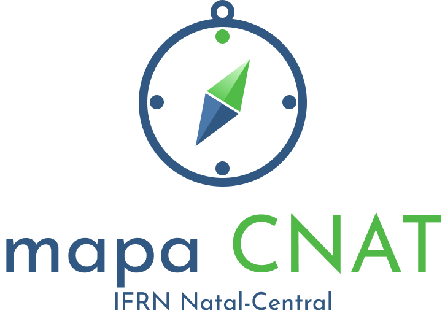

# CNAT MAPA

>Inserir uma logo para o projeto

>Inserir pequena descrição do projeto

# Missão

Ajudamos estudantes, visitantes e funcionários do IFRN-CNAT a navegar pela instituição de forma clara e objetiva para que minimizemos problemas de lozalização a respeito dos diversos blocos, setores, salas e laboratórios que formam o campus.

# Visão

Nossa visão é tornar nosso aplicativo a maior ferramenta de navegação intuitiva e detalhada de todos os campi.
Planejamos expandir a ferramenta a fim de versatilizá-la para qualquer instituição ou instalação que necessite de um suporte de exploração.

# Valores

Nossos valores são a preservação de privacidade, livre acesso para todos os usuários e acessibilidade interna. 

# Equipe e Formas de Contato

1. Allaphy Ricardo
2. Gabriel Albino
3. Gabriel Isaias
4. Jenyffer Danily

> Descrever as formas de contato da equipe - WhatsApp, Discord, etc.

# Reuniões Semanais da Equipe

1. Reunião com o orientaor OU reservada para apresentações - **"dia da semana", às "horário" no "local"**.

> Descrever dias, horários e local das demais reuniões da equipe

> [!TIP]
> Obs.: é fortemente recomendado que todas as reuniões da equipe sejam registradas na forma de tarefas (*issues*), contendo essencialmente informações como: presentes, temas discutidos e os encaminhamentos. Essas tarefas devem ser marcadas com o label correspondente.

# Documentação

Clique em cada um dos links abaixo para acessar o artefato específico.

1. [Documento de Visão](doc/visao/README.md)
1. [Protótipos de Interface com o Usuário](doc/prototipos/prototipos.md)
1. [Modelo de Casos de Uso](doc/cdu/README.md)
1. [Modelo de Domínio](doc/dominio/dominio.md)
1. [Modelo de Dados](doc/bd/bd.md)

# Manual da Desenvolvedor

[Orientações para os desenvolvedores do projeto](doc/guia-ds/guia.md)
