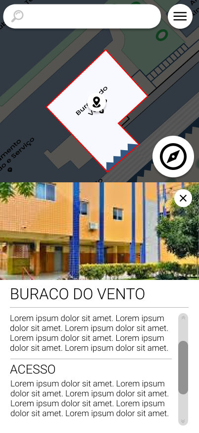

# CDU002. Uso de Sugestões do Banner

- **Ator principal**: Usuário qualquer
- **Atores secundários**: Nenhum
- **Resumo**: O Usuário localiza um local pelo banner
- **Pré-condição**: Usuário está vendo um banner
- **Pós-Condição**: Usuário é redirecionado a outro banner

## Fluxo Principal

1. Usuário
    1. Aperta no lugar da tela em que o banner possui um redirecionador para outro local do mapa
        - O usuário acessa uma âncora contida no banner de um local selecionado.
2. Sistema
    1. Busca as informações do local selecionado
        - O Javascript obterá o redirecionamento do link e obterá as coordenadas do local de destino.
    2. Expôe os dados de informações, imagens e descrições para o usuário visualmente
        - 