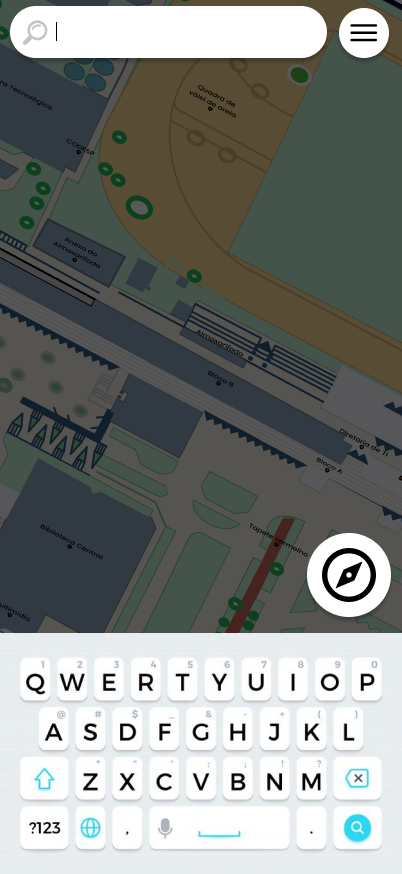
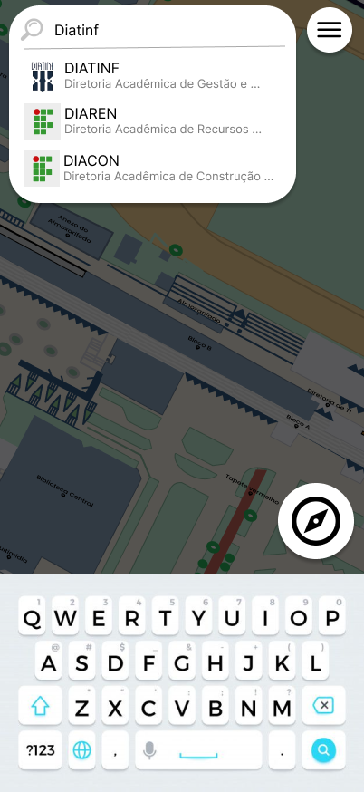

# CDU003. Exploração do Mapa

- **Ator principal**: Usuário qualquer
- **Atores secundários**: Nenhum
- **Resumo**: O Usuário navega pelo mapa em tempo real
- **Pré-condição**: Usuário está na tela inicial da aplicação
- **Pós-Condição**: Usuário tem o mapa atualizado

## Fluxo Alternativo I - Usuário usa a pesquisa para navegar

1. Usuário
    1. acessa a barra de pesquisa
       
    2. Insere o nome de um local
       - O usuário digita por um texto com o teclado recém aberto.
2. Sistema
    1. Sugere lugares relacionados
       
3. Usuário
    1. Usuário seleciona uma das sugestões de lugar
        - O usuário aperta um dos locais das sugestões apresentadas.
4. Sistema
    1. Busca os dados do local
        - Javascript faz um fetch pelo local em específico selecionado pelo usuário.
    2. Expôe os dados de informações, imagens e descrições para o usuário visualmente
        