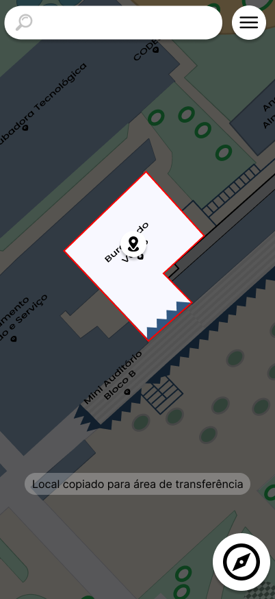

# CDU005. Compartilhar localização

- **Ator principal**: Usuário qualquer
- **Atores secundários**: Nenhum
- **Resumo**: O usuário compartilha uma localização
- **Pré-condição**: Usuário possui um pino
- **Pós-Condição**: Usuário tem o mapa atualizado

## Fluxo Principal

1. Usuário
    1. Pressiona um lugar
        - Usuário pressiona uma localização por pelo menos dois segundos.
        
2. Sistema
    1. Obtêm as coordenadas do pino
        - Sistema obtêm as coordenadas no mapa do local selecionado.
    2. Copia o local
        - Sistema cria um link para o local e copia esse link para a área de transferência.
        