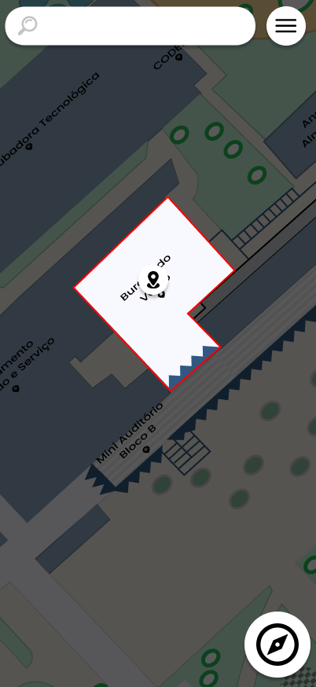

# CDU006. Receber localização

- **Ator principal**: Usuário qualquer
- **Atores secundários**: Nenhum
- **Resumo**: O usuário recebe uma localização redirecionando para o aplicativo
- **Pré-condição**: Usuário acessou um redirecionamento do aplicativo
- **Pós-Condição**: Usuário tem o mapa atualizado

## Fluxo Principal

1. Sistema
   1. Obtêm as coordenadas ou local do redirecionamento
      - O sistema interpreta o texto do link e extrai os dados que podem vir em forma de uma coordenada ou de um identificador de um local.
   2. Relocaliza o usuário dentro do mapa para o ponto obtido
      - Com o dado extraido ele converterá para uma coordenada válida e moverá o mapa para mostrar o local.
      