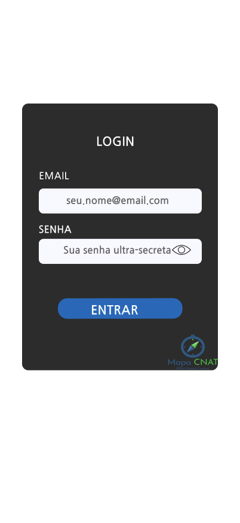
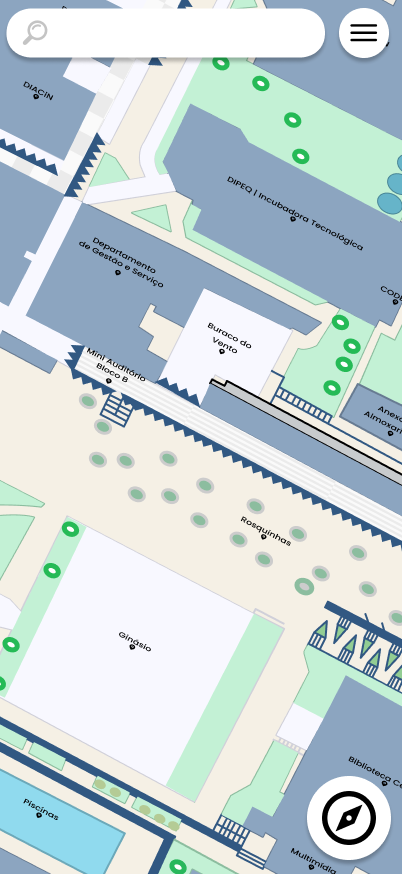

# CDU007. Login

- **Ator principal**: Usuário qualquer
- **Atores secundários**: Django/Banco de Dados
- **Resumo**: O Usuário realiza uma autenticação 
- **Pré-condição**: Usuário está na tela de login
- **Pós-Condição**: Usuário é apresentado á tela inicial do aplicativo

## Fluxo Principal

1. Usuário
   1. Preenche o formulário com seus dados
      - O usuário informa um email e uma senha.
      
2. Sistema
   1. Verifica os dados pelo sistema
      - Javascript verifica com o Back-End se os dados estão presentes no banco de dados.
   2. Redireciona o usuário para a tela inicial
      