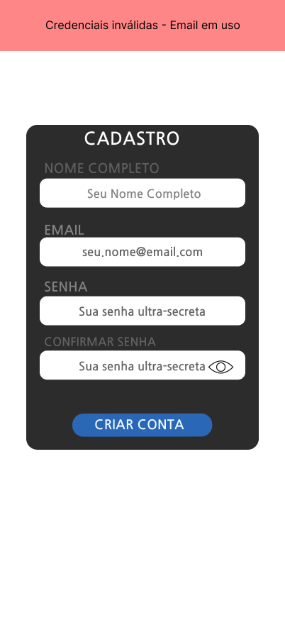

# CDU008. Signup

- **Ator principal**: Usuário qualquer
- **Atores secundários**: Django/Banco de Dados
- **Resumo**: O Usuário realiza um cadastro do seu usuário 
- **Pré-condição**: Usuário está na tela de cadastro
- **Pós-Condição**: Usuário é apresentado á tela inicial do aplicativo

## Fluxo de Exceção - Dados inválidos

1. Usuário
   1. Preenche o formulário com dados inválidos
      - O usuário informa um nome, email ou uma senha inválidos.
      
2. Sistema
   1. Verifica os dados pelo sistema
      - Javascript verifica se a senha é segura, se o email é válido e não está sendo usado e se o nome não está vazio.
   2. Informa uma mensagem de erro ao usuário
      - Javascript mostra um aviso de erro junto a mensagem do erro.
      