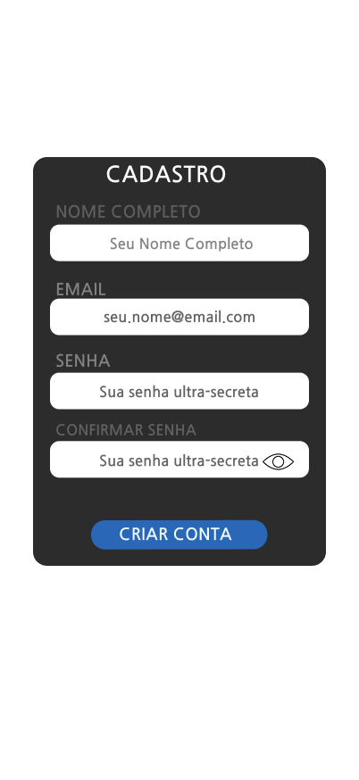

# CDU008. Signup

- **Ator principal**: Usuário qualquer
- **Atores secundários**: Django/Banco de Dados
- **Resumo**: O Usuário realiza um cadastro do seu usuário 
- **Pré-condição**: Usuário está na tela de cadastro
- **Pós-Condição**: Usuário é apresentado á tela inicial do aplicativo

## Fluxo Principal

1. Usuário
   1. Preenche o formulário com seus dados
      - O usuário informa o nome, email e a senha duas vezes.
      
2. Sistema
   1. Verifica se os dados podem ser utilizados
      - Javascript verifica se a senha é segura, se o email é válido e não está sendo usado e se o nome não está vazio.
   2. Redireciona o usuário para a tela inicial
      