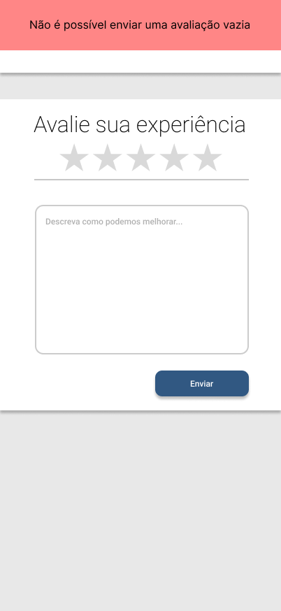

# CDU009. Feedback

- **Ator principal**: Usuário qualquer
- **Atores secundários**: Django/Banco de Dados
- **Resumo**: O Usuário realiza uma avaliação do sistema
- **Pré-condição**: Usuário está na tela inicial do aplicativo
- **Pós-Condição**: Usuário é apresentado á tela inicial do aplicativo

## Fluxo de Exceção - Dados inválidos

1. Usuário
   1. Preenche o formulário com dados inválidos
      - O usuário informa um nome, email ou uma senha inválidos.
      
2. Sistema
   1. Informa uma mensagem de erro ao usuário
      