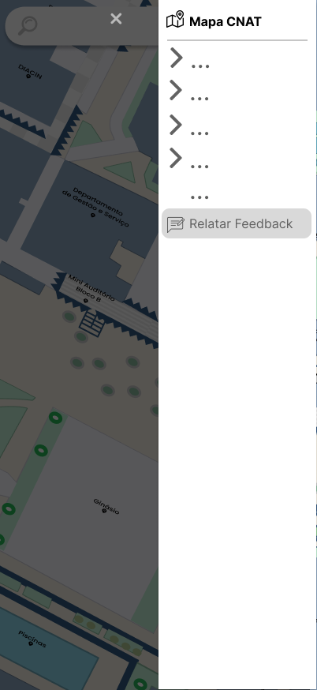
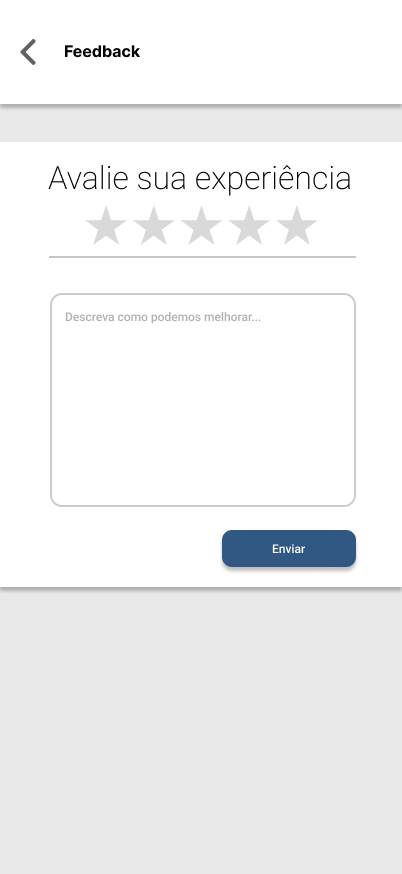
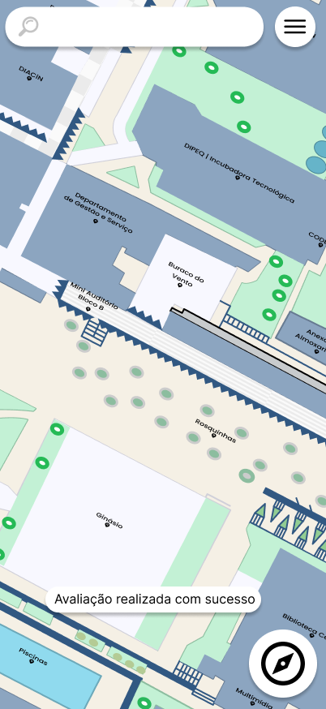

# CDU009. Feedback

- **Ator principal**: Usuário qualquer
- **Atores secundários**: Django/Banco de Dados
- **Resumo**: O Usuário realiza uma avaliação do sistema
- **Pré-condição**: Usuário está na tela inicial do aplicativo
- **Pós-Condição**: Usuário é apresentado á tela inicial do aplicativo

## Fluxo Principal

1. Usuário
   1. Aperta o menu de opções
      - O usuário seleciona o botão de menu
      
2. Sistema
   1. Expande o menu
      
3. Usuário
   Aperta a opção de feedback
      - Seleciona o botão de Relatar Feedback.
4. Sistema
   1. Redireciona o usuário para a tela de feedback
      
5. Usuário
   1. Informa uma avaliação
      - Preenche o formulário com sua avaliação
   2. Confirma a avaliação
      - Aperta o botão de enviar
6. Sistema
   1. Redireciona o usuário e mostra uma mensagem de sucesso
      